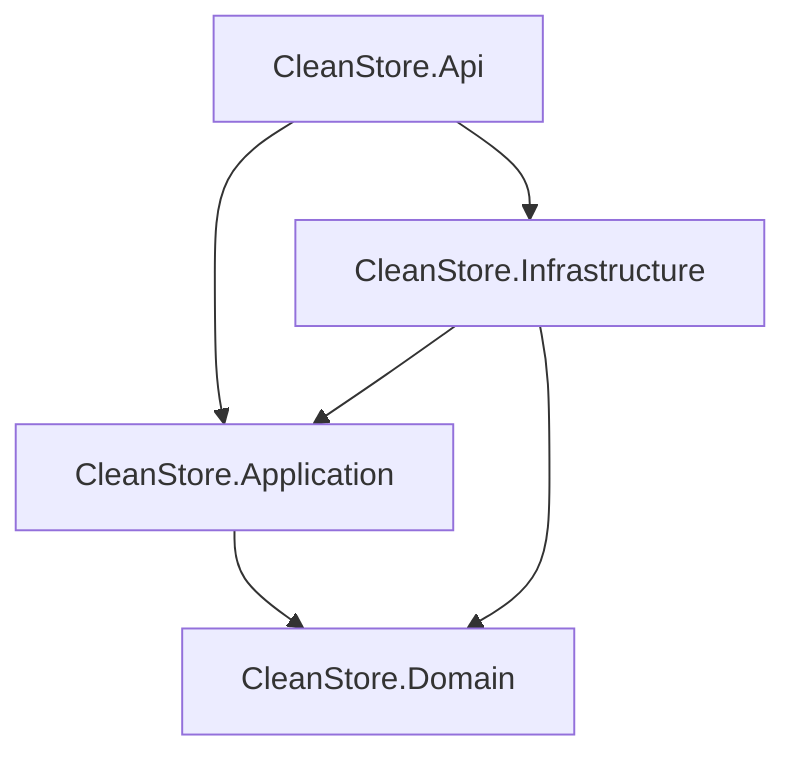

# Etapa 1 - Criação da Estrutura Básica do Projeto

## 🎯 Objetivo

Nesta primeira etapa, vamos criar a estrutura fundamental do projeto seguindo os princípios da Clean Architecture, organizando as camadas e configurando o ambiente de desenvolvimento.

## 📂 Estrutura de Pastas

Ao final desta etapa, teremos a seguinte estrutura:

```
CleanStore/
├── src/
│   ├── CleanStore.Domain/
│   ├── CleanStore.Application/
│   ├── CleanStore.Infrastructure/
│   └── CleanStore.Api/
├── tests/
├── docs/
├── CleanStore.sln
├── .gitignore
└── README.md
```

## 🛠️ Pré-requisitos

- [.NET 9 SDK](https://dotnet.microsoft.com/download/dotnet/9.0) instalado
- [Git](https://git-scm.com/) configurado
- Terminal ou prompt de comando

## 📋 Passo a Passo

### 1. Inicialização do Repositório Git

```bash
# Crie o diretório do projeto
mkdir CleanStore
cd CleanStore

# Inicialize o repositório Git
git init
```

### 2. Criação da Solution

```bash
# Crie a solution principal
dotnet new sln --name CleanStore
```

### 3. Criação das Pastas Organizacionais

```bash
# Crie as pastas para organizar o projeto
mkdir src
mkdir tests
mkdir docs

# Entre na pasta src
cd src
```

### 4. Criação dos Projetos das Camadas

#### 4.1 Camada de Domínio (Core)
```bash
# Biblioteca de classes para as entidades e regras de negócio
dotnet new classlib -n CleanStore.Domain
```

#### 4.2 Camada de Aplicação (Use Cases)
```bash
# Biblioteca de classes para casos de uso e serviços
dotnet new classlib -n CleanStore.Application
```

#### 4.3 Camada de Infraestrutura (External)
```bash
# Biblioteca de classes para acesso a dados e serviços externos
dotnet new classlib -n CleanStore.Infrastructure
```

#### 4.4 Camada de Apresentação (API)
```bash
# Projeto Web API
dotnet new web -n CleanStore.Api
```

### 5. Volta para o Diretório Raiz e Adição dos Projetos à Solution

```bash
# Volte para o diretório raiz
cd ..

# Adicione os projetos à solution
dotnet sln add src/CleanStore.Domain/CleanStore.Domain.csproj
dotnet sln add src/CleanStore.Application/CleanStore.Application.csproj
dotnet sln add src/CleanStore.Infrastructure/CleanStore.Infrastructure.csproj
dotnet sln add src/CleanStore.Api/CleanStore.Api.csproj
```

### 6. Configuração do .gitignore

```bash
# Crie o arquivo .gitignore para .NET
dotnet new gitignore
```

### 7. Verificação e Build Inicial

```bash
# Limpe possíveis builds anteriores
dotnet clean

# Execute o build para verificar se tudo está correto
dotnet build

# Restaure as dependências (se necessário)
dotnet restore
```

### 8. Primeiro Commit

```bash
# Adicione todos os arquivos ao stage
git add .

# Faça o primeiro commit
git commit -m "feat: estrutura básica do projeto CleanStore

- Criação da solution principal
- Implementação das 4 camadas da Clean Architecture:
  * Domain (entidades e regras de negócio)
  * Application (casos de uso)
  * Infrastructure (acesso a dados)
  * Api (apresentação)
- Configuração do .gitignore
- Estrutura de pastas organizada"
```

## 🔗 Configuração das Dependências entre Camadas

As dependências seguem o princípio da Clean Architecture:



### Adicionando as Referências

```bash
# CleanStore.Application depende de CleanStore.Domain
dotnet add src/CleanStore.Application/CleanStore.Application.csproj reference src/CleanStore.Domain/CleanStore.Domain.csproj

# CleanStore.Infrastructure depende de CleanStore.Domain e CleanStore.Application
dotnet add src/CleanStore.Infrastructure/CleanStore.Infrastructure.csproj reference src/CleanStore.Domain/CleanStore.Domain.csproj
dotnet add src/CleanStore.Infrastructure/CleanStore.Infrastructure.csproj reference src/CleanStore.Application/CleanStore.Application.csproj

# CleanStore.Api depende de CleanStore.Application e CleanStore.Infrastructure
dotnet add src/CleanStore.Api/CleanStore.Api.csproj reference src/CleanStore.Application/CleanStore.Application.csproj
dotnet add src/CleanStore.Api/CleanStore.Api.csproj reference src/CleanStore.Infrastructure/CleanStore.Infrastructure.csproj
```

## 🧪 Teste da Estrutura

```bash
# Execute o build novamente para verificar as dependências
dotnet build

# Execute a aplicação para verificar se tudo está funcionando
cd src/CleanStore.Api
dotnet run
```

A aplicação deve iniciar sem erros e estar disponível em `https://localhost:5001` ou `http://localhost:5000`.

## ✅ Verificação

Ao final desta etapa, você deve ter:

- [ ] Solution criada com 4 projetos
- [ ] Estrutura de pastas organizada
- [ ] Dependências entre camadas configuradas corretamente
- [ ] Build executando sem erros
- [ ] Primeiro commit realizado
- [ ] .gitignore configurado

## ⚠️ Troubleshooting

### Erro de Build

Se houver erros de build, verifique:
- Se o .NET 9 SDK está instalado: `dotnet --version`
- Se os caminhos dos projetos estão corretos
- Se não há referências circulares

### Problemas com Git

- Verifique se o Git está configurado: `git config --list`
- Configure seu nome e email se necessário:
  ```bash
  git config --global user.name "Seu Nome"
  git config --global user.email "seu.email@exemplo.com"
  ```

## 🎯 Próxima Etapa

Na [Etapa 2](etapa-02-dominios-e-contextos.md), vamos implementar a camada de domínio com as entidades, value objects e regras de negócio.

---

[← Voltar ao README](../README.md) | [Próxima Etapa →](etapa-02-dominios-e-contextos.md)
